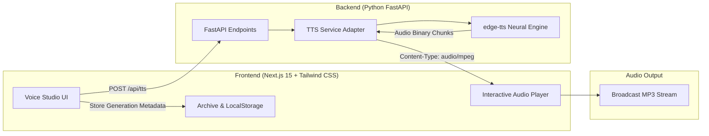

# Voxora AI - Advanced Neural Text-to-Speech Studio

[](https://nextjs.org/)
[](https://fastapi.tiangolo.com/)
[](https://tailwindcss.com/)
[](https://github.com/rany2/edge-tts)

> **Trade Name**: **ER RAHUL THAKUR**  
> **Developer & Creator**: **ER RAHUL THAKUR** ([@rahul000025](https://github.com/rahul000025))

**Voxora AI** is a complete, commercial-grade AI Text-to-Speech Voice Generator web application. It combines a sleek, modern dark-themed SaaS interface with lime-green neon accents and a high-performance Python FastAPI backend powered by Microsoft's neural voice engine (`edge-tts`).

Synthesize life-like speech in **Hindi (Devanagari / Hinglish)**, **English (Indian, American, British accents)**, and over **50+ languages**, with granular controls over speaking rate, pitch, and volume, audio waveform visualization, generation history, and instant MP3 downloads.

---

## Architecture Overview



---

## Key Features

1. **Neural Speech Generation**:
   - Zero-latency neural voice synthesis producing high-quality MP3 audio files.
2. **Deep Hindi & English Support**:
   - Native Hindi voices: **Swara** (Female) and **Madhur** (Male).
   - Indian English voices: **Neerja** (Female) and **Prabhat** (Male).
   - American & British voices: **Jenny**, **Guy**, **Aria**, **Christopher**, **Sonia**, **Ryan**, and 300+ global voices.
3. **Studio Voice Controls**:
   - **Speaking Rate (Speed)**: $-50\%$ to $+100\%$ with real-time percentage indicators.
   - **Pitch Adjustment**: $-50\text{Hz}$ to $+50\text{Hz}$ for deeper tones or brighter timbre.
   - **Volume Gain**: $-50\%$ to $+50\%$ output dynamics.
   - Quick one-click presets: *Natural*, *Fast (+25%)*, *Slow (-15%)*, *Deep Pitch*, *High Pitch*.
4. **Interactive Audio Studio Player**:
   - Animated audio waveform visualizer.
   - Scrubbable progress bar with elapsed and remaining time codes.
   - Replay, play/pause, volume control with mute toggle.
   - Playback speed multiplier ($0.8\times$, $1\times$, $1.25\times$, $1.5\times$, $2\times$).
   - Direct **Download MP3** button with custom metadata filename.
5. **Smart Text Editor**:
   - Live character counter with $5,000$ character ceiling.
   - Quick sample script presets: *Hindi Story*, *Hindi Motivation*, *Product Promo*, *Tech Podcast*, and *Customer Support*.
   - One-click copy and clear buttons.
6. **Voice Audition & Directory**:
   - Audition any voice with a 2-second live audio snippet before generating long text.
   - Filter by language (Hindi, English, Spanish, French, German, Japanese, etc.) and gender (Female / Male).
7. **Generation History & Archive**:
   - Automatic local storage persistence with timestamp, voice used, audio replay, and re-download.
   - Dedicated Archive page (`/history`) with search filtering and batch clear options.
   - Optional **Supabase** cloud database sync for user accounts.
8. **Commercial SaaS Design**:
   - Deep slate/black palette (`#090b0e`) with electric lime-green accents (`#a3e635`).
   - Frosted glass cards, subtle background grid lines, and glowing buttons.
   - Light/Dark theme toggle with persisted user preference.

---

## Directory Structure

```
d:\Voxora.Ai\
├── backend/
│   ├── app/
│   │   ├── __init__.py
│   │   ├── main.py              # FastAPI app, CORS, lifespan, exception handling
│   │   ├── config.py            # Port, CORS origins, rate limits
│   │   ├── models.py            # Pydantic schemas (TTSRequest, VoiceItem, etc.)
│   │   ├── routers/
│   │   │   ├── __init__.py
│   │   │   └── tts.py           # /health, /api/voices, /api/tts, /api/preview
│   │   └── services/
│   │       ├── __init__.py
│   │       └── tts_service.py   # edge-tts manager & audio streaming
│   ├── requirements.txt         # Python dependencies
│   ├── .env.example
│   ├── .env
│   └── README.md
├── frontend/
│   ├── src/
│   │   ├── app/
│   │   │   ├── layout.tsx       # Root layout + ThemeProvider & ToastProvider
│   │   │   ├── globals.css      # Dark theme, neon accents & slider styles
│   │   │   ├── page.tsx         # Modern SaaS Landing Page + Quick Audition Widget
│   │   │   ├── studio/
│   │   │   │   └── page.tsx     # Full Neural Voice Studio Dashboard
│   │   │   └── history/
│   │   │       └── page.tsx     # Generations History & Archive
│   │   ├── components/
│   │   │   ├── Navbar.tsx       # Navigation + Live Backend Health indicator
│   │   │   ├── Footer.tsx       # SaaS footer with voice directory
│   │   │   ├── HeroSection.tsx  # Hero with audition showcase
│   │   │   ├── Features.tsx     # 6-card grid with lime accents
│   │   │   ├── ThemeToggle.tsx  # Dark / Light theme toggle
│   │   │   ├── Toast.tsx        # Floating notification system
│   │   │   ├── SupabaseAuthModal.tsx # Optional cloud sync modal
│   │   │   └── VoiceStudio/
│   │   │       ├── TextEditor.tsx     # Text area, samples & counter
│   │   │       ├── VoiceSelector.tsx  # Search modal & voice audition
│   │   │       ├── VoiceSettings.tsx  # Speed, Pitch, Volume sliders
│   │   │       ├── AudioPlayer.tsx    # Waveform player & MP3 download
│   │   │       └── HistoryDrawer.tsx  # Quick history slider
│   │   └── lib/
│   │       ├── api.ts           # Fetch client for FastAPI backend
│   │       ├── types.ts         # TypeScript interfaces
│   │       ├── sampleData.ts    # Curated voices & sample scripts
│   │       ├── storage.ts       # LocalStorage & Supabase sync
│   │       └── supabase.ts      # Safe Supabase client helper
│   ├── package.json
│   ├── tsconfig.json
│   ├── tailwind.config.ts
│   ├── next.config.ts
│   ├── .env.example
│   └── .env.local
├── run_backend.bat              # 1-click Windows script for backend
├── run_frontend.bat             # 1-click Windows script for frontend
├── start_all.bat                # 1-click script to start both servers
└── README.md
```

---

## Quick Start Guide

### Run with Docker

Install Docker Desktop, then run from the repository root:

```bash
docker compose up --build
```

Open the studio at [http://localhost:3000/studio](http://localhost:3000/studio). The frontend sends API requests through its same-origin Next.js proxy, which forwards them to the backend container. Stop the stack with `docker compose down`.

You can run both servers in two simple steps:

### Option A: Using Windows 1-Click Launchers

1. Double-click `start_all.bat` in the project root directory.
   - It will automatically create the virtual environment, install backend dependencies, install frontend packages, and launch both servers!

Or launch them individually:
- `run_backend.bat` (Starts FastAPI on `http://localhost:8000`)
- `run_frontend.bat` (Starts Next.js on `http://localhost:3000`)

---

### Option B: Manual Setup

#### 1. Start the Python FastAPI Backend

Open a terminal and run:

```bash
cd backend

# Create virtual environment
python -m venv venv

# Activate on Windows:
venv\Scripts\activate
# Activate on Linux/macOS:
# source venv/bin/activate

# Install dependencies
pip install -r requirements.txt

# Run the FastAPI server
uvicorn app.main:app --reload --port 8000
```

Verify backend health at:
- **Swagger Documentation**: [http://localhost:8000/docs](http://localhost:8000/docs)
- **Health Check**: [http://localhost:8000/health](http://localhost:8000/health)

---

#### 2. Start the Next.js 15 Frontend

Open a second terminal and run:

```bash
cd frontend

# Install dependencies
npm install

# Run development server
npm run dev
```

Open [http://localhost:3000](http://localhost:3000) in your browser.

---

## Environment Variables

### Backend (`backend/.env`)
| Variable | Default | Description |
| :--- | :--- | :--- |
| `PORT` | `8000` | Port for the FastAPI server |
| `HOST` | `0.0.0.0` | Host address to bind |
| `CORS_ORIGINS` | `http://localhost:3000,http://127.0.0.1:3000` | Allowed origins |
| `MAX_TEXT_LENGTH` | `5000` | Maximum character length allowed per TTS request |
| `RATE_LIMIT_PER_MINUTE` | `60` | Request rate limiter |

### Frontend (`frontend/.env.local`)
| Variable | Default | Description |
| :--- | :--- | :--- |
| `NEXT_PUBLIC_API_URL` | `http://localhost:8000` | Backend API URL |
| `NEXT_PUBLIC_SUPABASE_URL` | *Optional* | Your Supabase Project URL for cloud account sync |
| `NEXT_PUBLIC_SUPABASE_ANON_KEY` | *Optional* | Your Supabase Anon Public Key |

*(Note: Leaving the Supabase keys empty enables Local Guest mode automatically with zero configuration required).*

---

## API Reference

### 1. `GET /health`
Returns service status and total number of neural voices loaded.
```json
{
  "status": "healthy",
  "service": "Voxora AI - Text-to-Speech Engine",
  "version": "1.0.0",
  "voices_loaded": 328
}
```

### 2. `GET /api/voices`
Query parameters:
- `language`: (Optional) e.g. `Hindi`, `English`
- `gender`: (Optional) `Female` or `Male`
- `search`: (Optional) `Swara`, `Neerja`, `Jenny`

### 3. `POST /api/tts`
Request Body:
```json
{
  "text": "नमस्ते! वोक्सोरा एआई में आपका स्वागत है।",
  "voice": "hi-IN-SwaraNeural",
  "rate": 0,
  "pitch": 0,
  "volume": 0
}
```
Response:
- Binary MP3 stream (`Content-Type: audio/mpeg`)
- Header: `Content-Disposition: inline; filename=voxora-speech.mp3`

### 4. `POST /api/preview`
Request Body:
```json
{
  "voice": "hi-IN-MadhurNeural",
  "custom_text": "नमस्ते! मैं मधुर हूँ।"
}
```
Response:
- Binary MP3 sample (`Content-Type: audio/mpeg`)

---

## How to Test Speech Generation

1. Launch both servers (Backend on `8000`, Frontend on `3000`).
2. Visit [http://localhost:3000/studio](http://localhost:3000/studio).
3. Under **Samples**, click **"हिंदी कहानी वाचन"** or **"Product Promo"**.
4. In the **Selected Voice** panel on the right, click the preview icon to audition the voice.
5. Click **Generate Speech**.
6. The interactive player will load the generated MP3, animate the waveform, and allow you to seek, adjust playback speed, and click **Download MP3**.

---

## Production Deployment & TTS Provider Alternatives

### Edge-TTS Engine (Current Implementation)
- **Pros**: Completely free, no API keys or subscription required, high fidelity neural audio, native support for 300+ Microsoft neural voices including Hindi and Indian English.
- **Considerations**: Communicates with Microsoft Edge's public endpoints. For massive enterprise scale (hundreds of simultaneous concurrent requests), you should add server-side Redis caching or consider paid enterprise APIs below.

### Production Alternatives
When scaling Voxora AI to a high-volume SaaS business:
1. **Azure Cognitive Services Speech**:
   - Uses the identical voice names (`hi-IN-SwaraNeural`, `en-US-JennyNeural`, etc.).
   - Official Microsoft cloud SLA, custom voice cloning, and high concurrency limits.
2. **ElevenLabs**:
   - Drop-in adapter in `tts_service.py` for ultra-realistic emotion and custom voice cloning.
3. **Amazon Polly / Google Cloud TTS**:
   - Alternative global neural engines with pay-as-you-go pricing.

---

## License & Copyright
MIT License.  
**Trade Name**: **ER RAHUL THAKUR**  
Copyright © 2026 **ER RAHUL THAKUR**. Built with precision for creators, podcasters, and developers.
